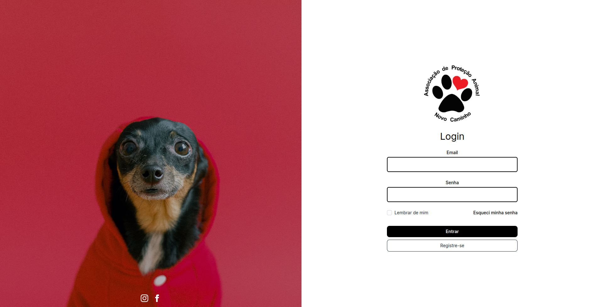
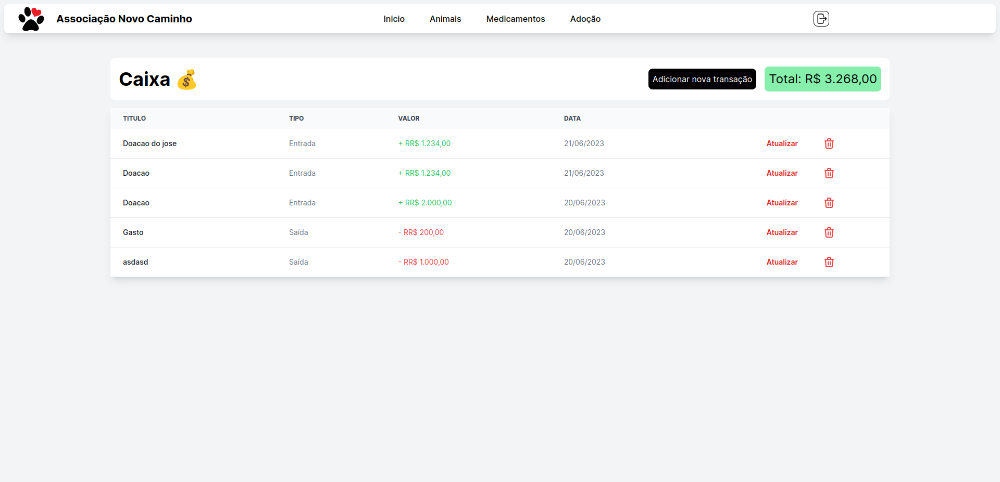

# Administração e Controle de Adoção para ONG Novo Caminho de Batatais-Sp

Este projeto tem como objetivo desenvolver uma aplicação de administração e controle de adoção para uma ONG de resgate de animais de rua. Através dessa aplicação, será possível facilitar e agilizar o processo de adoção, garantindo que os animais sejam devidamente acolhidos por famílias responsáveis.

## Funcionalidades Principais

- Cadastro de Animais: Os administradores da ONG poderão cadastrar os animais resgatados, fornecendo informações detalhadas sobre cada um deles, como espécie, raça, idade, sexo, entre outros.
- Perfil de Adoção: A aplicação permitirá que interessados em adotar um animal preencham um perfil, informando suas preferências e características desejadas no animal de estimação.
- Agendamento de Visitas: Os adotantes poderão agendar visitas à ONG para conhecerem pessoalmente os animais disponíveis para adoção.
- Acompanhamento Pós-Adoção: A aplicação permitirá que os adotantes relatem o progresso e o bem-estar dos animais após a adoção, fornecendo informações úteis para a ONG e promovendo a transparência e o cuidado com os animais adotados.

## Como Contribuir

Se você deseja contribuir para este projeto, siga as etapas abaixo:

Faça um fork deste repositório e clone-o para o seu ambiente local.
Crie uma nova branch para implementar suas alterações: git checkout -b minha-nova-feature.
Faça as alterações necessárias e commit-as: git commit -m 'Implementação da minha nova feature'.
Envie suas alterações para o repositório remoto: git push origin minha-nova-feature.
Abra um pull request no repositório original.

## Screenshots

Inclua aqui algumas screenshots do seu projeto para visualização.

### Tela de Login

### Tela de Cadastro

### Tela de Esqueci minha senha

### Dashboard

### Tela de Index de animal

### Tela de Criar animal

### Tela de Alterar dados de animal

### Tela de Visualizar de animal

### Tela de Medicamentos

### Tela de Criacao de medicamentos

### Tela de Adocao

## Tela de controle de caixa

## Autor
Eric Poloni Araujo

## Contato

Se você tiver alguma dúvida, entre em contato com seu nome via email para: ericpoloni@gmail.com.
